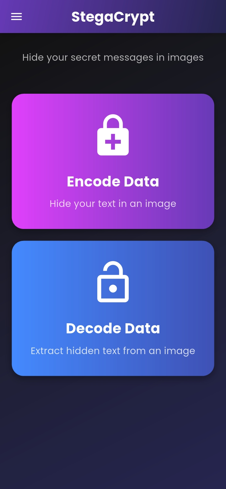
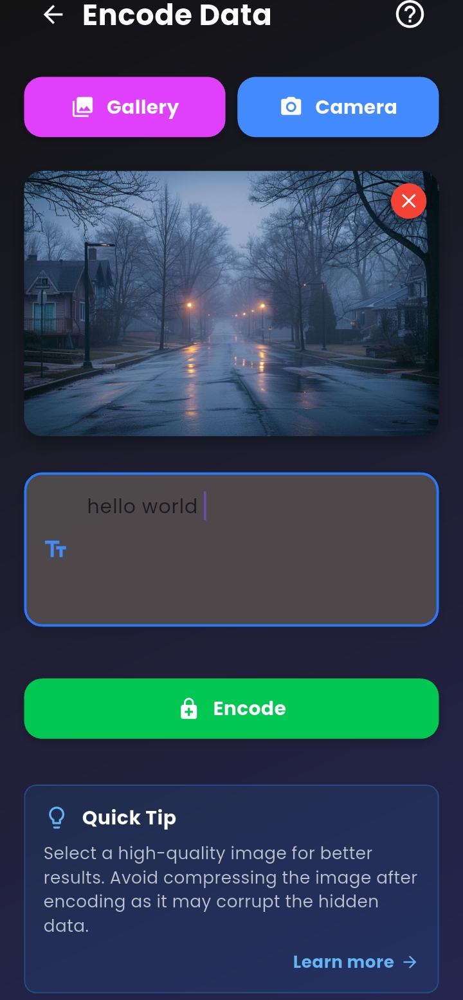
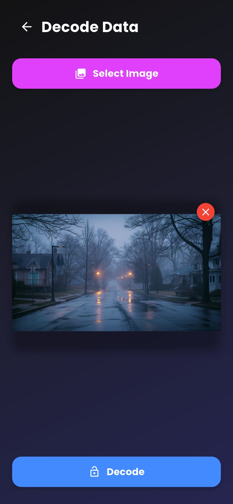
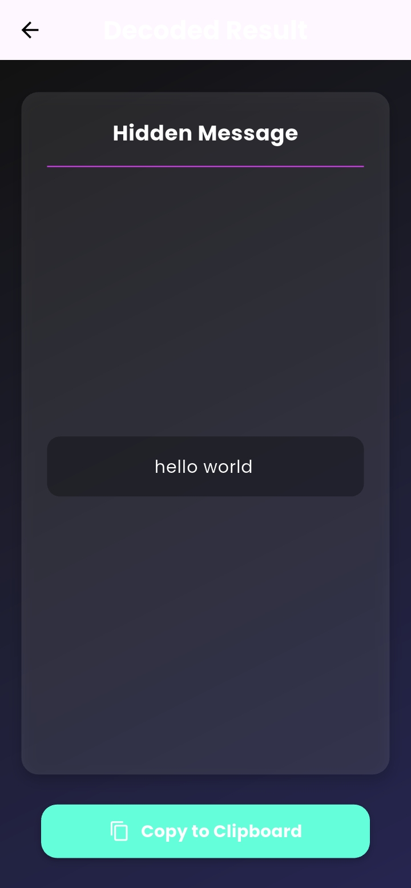

# StegaCrypt 🔐

> Hide secret text messages inside images — invisible to the naked eye.

A Flutter-based image steganography app that embeds secret text into PNG images using the **2nd Least Significant Bit (2nd LSB)** technique. The encoded image looks identical to the original.

---

## 📸 Screenshots

<table>
  <tr>
    <td align="center"><b>Home</b></td>
    <td align="center"><b>Encode</b></td>
    <td align="center"><b>Decode</b></td>
    <td align="center"><b>Hidden Message</b></td>
  </tr>
  <tr>
    <td></td>
    <td></td>
    <td></td>
    <td></td>
  </tr>
</table>

---

## ✨ Features

- **Encode** — Hide a text message inside any image from your gallery or camera
- **Decode** — Extract hidden text from a previously encoded image
- Encoded images auto-saved to `DCIM/` on your device
- Share encoded images directly from the app

---

## 🔐 Example Use Cases

| Use Case | Description |
|---|---|
| 🗒️ Secret notes | Embed personal notes inside a photo only you can decode |
| 💌 Hidden messages | Send a secret message to a friend inside a normal-looking image |
| 🎭 Fun & pranks | Hide a funny message in a photo and challenge friends to find it |
| 🔒 Private data | Store sensitive info invisibly inside an image |

---

## 🚀 Demo

1. Pick any image from your gallery or camera
2. Type your secret message
3. Hit **Encode** — a new PNG is saved to your `DCIM/` folder
4. Share it with anyone
5. Open the app → **Decode** → select the image → message revealed ✅

---

## 🛠 How It Works

Text is converted to binary and embedded into the **2nd LSB** of each RGB channel per pixel. A 32-bit header stores the message length for accurate extraction. The visual difference is imperceptible to the human eye.

```
Original pixel R: 1101 1010
Encoded pixel R:  1101 1x10  ← 2nd bit carries your message
```

Max capacity: `width × height × 3 − 32` bits

---

## Tech Stack

- Flutter (Dart) — SDK `^3.7.0`
- [`image`](https://pub.dev/packages/image) — pixel-level image manipulation
- [`image_picker`](https://pub.dev/packages/image_picker) — gallery/camera access
- [`permission_handler`](https://pub.dev/packages/permission_handler) — runtime permissions
- [`share_plus`](https://pub.dev/packages/share_plus) — share encoded images

---

## Getting Started

### Prerequisites

- Flutter SDK `^3.7.0`
- Android device or emulator (API 21+)

### Run

```bash
flutter pub get
flutter run
```

### Build APK

```bash
flutter build apk --release
```

APK output: `build/app/outputs/flutter-apk/app-release.apk`

---

## Permissions Required

- Camera
- Storage (read/write)

---

## Limitations

- PNG output only (lossless format required — JPEG compression destroys hidden data)
- Message size limited by image resolution
