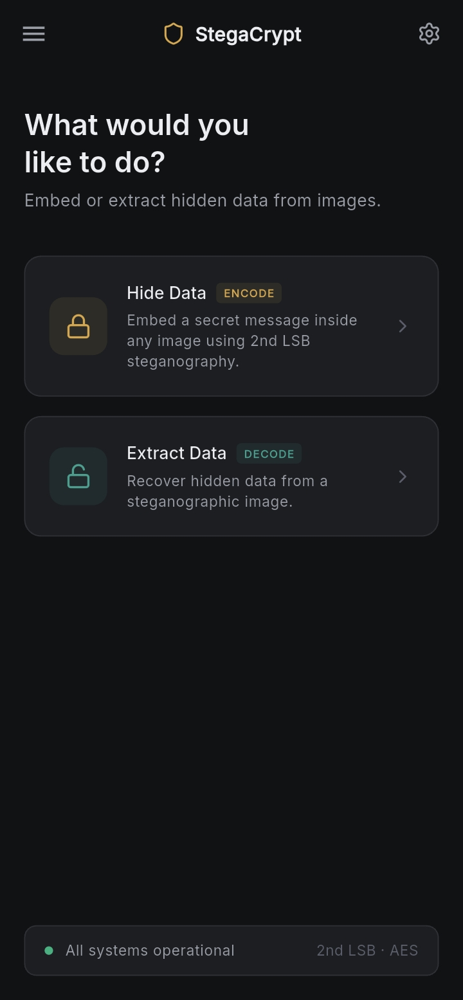
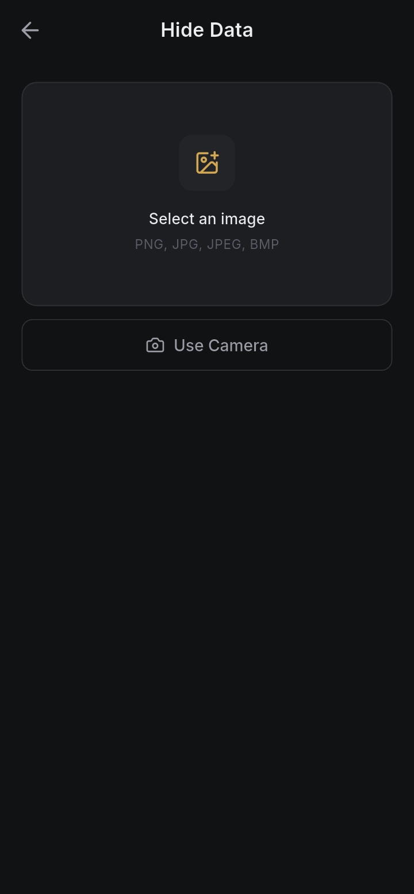
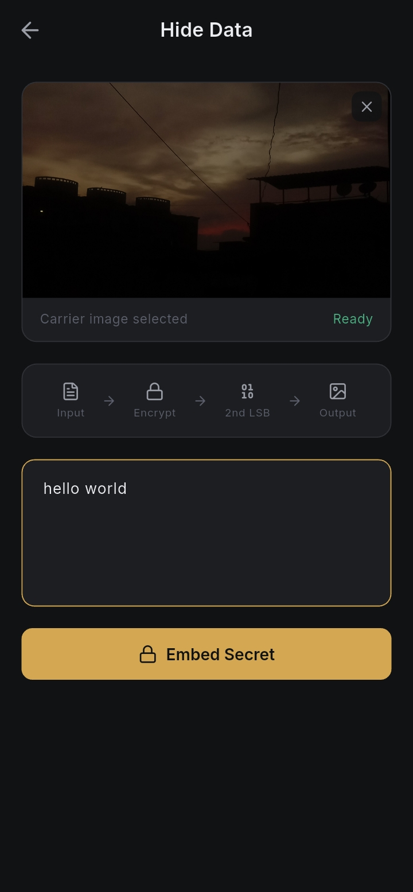
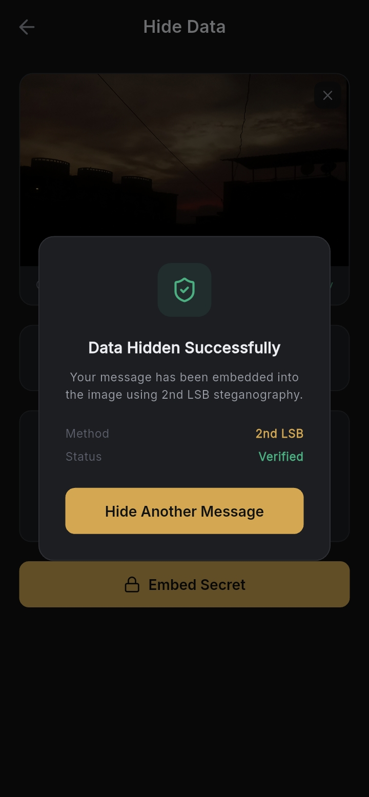
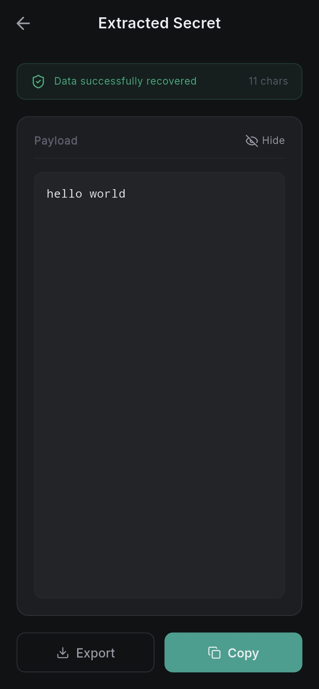

# StegaCrypt

A mobile steganography application built with Flutter that hides secret text messages inside ordinary images using the 2nd Least Significant Bit (2nd LSB) technique. The encoded image is visually identical to the original, making the hidden data imperceptible to the naked eye.

---

## Screenshots

<p align="center">
  
  
  
  
  
</p>

---

## Table of Contents

- [Overview](#overview)
- [How the Algorithm Works](#how-the-algorithm-works)
- [Features](#features)
- [Project Structure](#project-structure)
- [Dependencies](#dependencies)
- [Getting Started](#getting-started)
- [Usage](#usage)
- [Forking and Modifying](#forking-and-modifying)
- [Security Considerations](#security-considerations)
- [License](#license)

---

## Overview

StegaCrypt implements image steganography — the practice of concealing information within a non-secret medium. Unlike encryption, which makes data unreadable, steganography hides the very existence of the data. A carrier image with an embedded message looks completely normal to anyone viewing it.

The app targets Android and is written entirely in Dart using the Flutter framework. It operates fully offline with no network calls, no cloud storage, and no third-party analytics. All processing happens on-device.

---

## How the Algorithm Works

### Encoding

Each pixel in an image has three color channels: Red, Green, and Blue. Each channel is stored as an 8-bit integer (0–255). The 2nd LSB technique modifies bit position 1 (zero-indexed from the right) of each channel value to carry one bit of the secret message.

**Why the 2nd LSB and not the 1st LSB?**

The 1st LSB (bit 0) is the most commonly targeted bit in steganography detection tools. Using bit 1 instead provides a marginal increase in resistance to naive steganalysis while still producing a maximum color deviation of 2 per channel — a change completely invisible to the human eye.

**Step-by-step encoding process:**

1. The secret text is converted to its binary representation. Each character becomes an 8-bit binary string based on its Unicode code point.

2. A 32-bit header is prepended to the binary payload. This header stores the total bit length of the payload and is used during extraction to know exactly how many bits to read.

3. The combined binary string (header + payload) is written into the image pixel by pixel, left to right, top to bottom. For each pixel, one bit is written into the R channel, one into G, and one into B.

4. To write a bit into a channel, the channel value is masked with `0xFD` (binary `11111101`) to clear bit 1, then the target bit is shifted left by 1 and OR'd in:

   ```
   new_value = (original & 0xFD) | (bit << 1)
   ```

5. The modified image is saved as a lossless PNG to preserve every bit. Saving as JPEG would destroy the hidden data because JPEG uses lossy compression.

**Capacity:**

For an image of width W and height H, the maximum payload in bits is:

```
max_bits = (W * H * 3) - 32
```

The 32-bit header occupies the first 32 channel slots. A 1920x1080 image can carry approximately 777,600 bits, or roughly 97,200 characters.

---

### Decoding

1. The first 32 channel values are read from the image. Bit 1 is extracted from each using `(value & 2) >> 1`. These 32 bits are assembled into an integer that represents the payload length.

2. The length is validated against the image's maximum capacity. If it falls outside a valid range, the image is considered to contain no hidden data.

3. The next `dataLength` channel values are read in the same manner, reconstructing the binary payload string.

4. The binary string is split into 8-bit chunks. Each chunk is parsed as an integer and converted back to its character using `String.fromCharCode`. Null characters (code point 0) are discarded.

5. The reconstructed string is returned and displayed to the user.

---

## Features

- Embed secret text into PNG, JPG, JPEG, and BMP images
- Extract hidden text from encoded images
- Camera support for capturing images directly
- Lossless PNG output to preserve embedded data
- Fully offline — no internet connection required
- Clean dark UI with warm amber and teal accent palette
- Payload reveal/hide toggle on the result screen
- Clipboard copy for extracted secrets

---

## Project Structure

```
StegaCrypt/
├── android/                        # Android platform code and Gradle config
├── ios/                            # iOS platform code (build target not configured)
├── assets/
│   ├── fonts/                      # Poppins font family (Light, Regular, Bold)
│   ├── logo/                       # App launcher icon
│   └── screenshots/                # UI screenshots used in this README
├── lib/
│   ├── main.dart                   # App entry point, orientation lock, theme setup
│   ├── components/
│   │   ├── app_drawer.dart         # Side navigation drawer
│   │   ├── custom_button.dart      # Reusable button component
│   │   ├── custom_input.dart       # Reusable text input component
│   │   └── image_preview.dart      # Image display with clear button
│   ├── services/
│   │   ├── camera_service.dart     # Gallery picker and camera capture via image_picker
│   │   ├── encoding_service.dart   # 2nd LSB encoding logic and PNG output
│   │   ├── decoding_service.dart   # 2nd LSB extraction and text reconstruction
│   │   └── storage_service.dart    # File save helpers and directory management
│   ├── theme/
│   │   ├── app_colors.dart         # Centralized color palette
│   │   └── app_theme.dart          # ThemeData configuration (typography, buttons, cards)
│   └── views/
│       ├── splash_screen.dart      # Animated launch screen
│       ├── home_page.dart          # Main dashboard with encode/decode entry points
│       ├── encode_page.dart        # Image selection, message input, encoding flow
│       ├── decode_page.dart        # Image selection and decoding trigger
│       ├── decode_result_page.dart # Extracted payload display with copy action
│       ├── instruction_page.dart   # Step-by-step usage guide
│       └── security_info_page.dart # Security limitations and best practices
├── test/
│   └── widget_test.dart
├── pubspec.yaml
├── LICENSE
└── README.md
```

---

## Dependencies

| Package | Version | Purpose |
|---|---|---|
| `image` | ^4.9.2 | Pixel-level image decoding and encoding |
| `image_picker` | ^1.2.3 | Gallery and camera image selection |
| `google_fonts` | ^8.2.1 | Inter typeface via Google Fonts |
| `flutter_spinkit` | ^5.2.2 | Loading animations |
| `lucide_icons_flutter` | ^3.1.18 | Icon set |
| `fluttertoast` | ^10.0.0 | Toast notifications |
| `cupertino_icons` | ^1.0.8 | iOS-style icons |

**Dev dependencies:**

| Package | Version | Purpose |
|---|---|---|
| `flutter_lints` | ^6.0.0 | Lint rules |
| `flutter_launcher_icons` | ^0.14.4 | App icon generation |

---

## Getting Started

### Prerequisites

- Flutter SDK `^3.13.1`
- Dart SDK `^3.13.1`
- Android Studio or VS Code with the Flutter plugin
- A connected Android device or emulator (API 21+)

### Installation

1. Clone the repository:

   ```bash
   git clone https://github.com/your-username/stegacrypt.git
   cd stegacrypt
   ```

2. Install dependencies:

   ```bash
   flutter pub get
   ```

3. Run on a connected device:

   ```bash
   flutter run
   ```

4. Build a release APK:

   ```bash
   flutter build apk --release
   ```

   The output APK will be at `build/app/outputs/flutter-apk/app-release.apk`.

---

## Usage

### Hiding a Message

1. Open the app and tap **Hide Data** on the home screen.
2. Tap the upload area to select an image from your gallery, or tap **Use Camera** to capture one.
3. Type your secret message in the text field.
4. Tap **Embed Secret**. The app will process the image and save the encoded PNG to your device's DCIM folder. If external storage is unavailable, it falls back to the app's temporary directory.
5. A confirmation dialog will appear when the operation is complete.

### Extracting a Message

1. Tap **Extract Data** on the home screen.
2. Select the encoded image from your gallery.
3. Tap **Extract Secret**. The app reads the 2nd LSB layer and reconstructs the hidden text.
4. The result screen shows the payload length and a reveal/hide toggle. Use the **Copy** button to copy the text to your clipboard.

### Important Notes

- Always share the encoded image as a file, not through messaging apps like WhatsApp or Telegram. These platforms re-compress images, which destroys the hidden data.
- The output is always saved as PNG regardless of the input format, because PNG is lossless.
- There is no password protection built into the current version. Anyone with this app can extract data from an encoded image if they know it contains hidden data.

---

## Forking and Modifying

### Fork and Clone

```bash
git clone https://github.com/your-username/stegacrypt.git
cd stegacrypt
flutter pub get
```

### Changing the Color Palette

All colors are defined in a single file: `lib/theme/app_colors.dart`. Modify the constants there and the changes will propagate throughout the entire app.

### Swapping the Steganography Algorithm

The encoding and decoding logic is fully isolated in two service files:

- `lib/services/encoding_service.dart` — contains `encodeDataIntoImage(String text, File imageFile)`
- `lib/services/decoding_service.dart` — contains `decodeDataFromImage(File imageFile)`

Both services follow the singleton pattern and expose a single public async method each. To replace the 2nd LSB technique with a different algorithm (e.g., DCT-based steganography, 1st LSB, or alpha channel encoding), rewrite only these two files. The UI layer calls these methods directly and does not need to change.

### Adding Encryption

Currently the payload is embedded as plain text. To add a pre-encryption layer before embedding:

1. Add a cipher package to `pubspec.yaml` (e.g., `encrypt: ^5.0.3`).
2. In `encoding_service.dart`, encrypt the text before calling `_textToBinary`.
3. In `decoding_service.dart`, decrypt the result of `_binaryToText` before returning it.
4. Add a password input field to `encode_page.dart` and `decode_page.dart` and pass it through to the services.

### Generating a New App Icon

Replace `assets/logo/logo.png` with your new icon (minimum 1024x1024 px, PNG), then run:

```bash
flutter pub run flutter_launcher_icons
```

### Running on iOS

The iOS target exists in the project but the launcher icon generation is disabled for iOS in `pubspec.yaml`. To enable it, change `ios: false` to `ios: true` in the `flutter_launcher_icons` section of `pubspec.yaml`, then run the icon generation command above. You will also need a valid Apple Developer account and Xcode to build and sign the app.

---

## Security Considerations

StegaCrypt provides security through obscurity. The hidden data is not encrypted by default — it is only concealed. Consider the following before using this app for sensitive information:

- Anyone with access to the encoded image and this app can extract the hidden message.
- Standard steganalysis tools that analyze bit-plane statistics may detect the presence of hidden data, though the 2nd LSB choice reduces this risk compared to 1st LSB.
- Lossy image compression (JPEG re-encoding, social media uploads) will corrupt or destroy the hidden payload entirely.
- For genuinely sensitive data, encrypt your message with a strong cipher (AES-256, PGP) before embedding it with StegaCrypt.

---

## License

This project is licensed under the MIT License.

```
MIT License

Copyright (c) 2026 Raj Parihar

Permission is hereby granted, free of charge, to any person obtaining a copy
of this software and associated documentation files (the "Software"), to deal
in the Software without restriction, including without limitation the rights
to use, copy, modify, merge, publish, distribute, sublicense, and/or sell
copies of the Software, and to permit persons to whom the Software is
furnished to do so, subject to the following conditions:

The above copyright notice and this permission notice shall be included in all
copies or substantial portions of the Software.

THE SOFTWARE IS PROVIDED "AS IS", WITHOUT WARRANTY OF ANY KIND, EXPRESS OR
IMPLIED, INCLUDING BUT NOT LIMITED TO THE WARRANTIES OF MERCHANTABILITY,
FITNESS FOR A PARTICULAR PURPOSE AND NONINFRINGEMENT. IN NO EVENT SHALL THE
AUTHORS OR COPYRIGHT HOLDERS BE LIABLE FOR ANY CLAIM, DAMAGES OR OTHER
LIABILITY, WHETHER IN AN ACTION OF CONTRACT, TORT OR OTHERWISE, ARISING FROM,
OUT OF OR IN CONNECTION WITH THE SOFTWARE OR THE USE OR OTHER DEALINGS IN THE
SOFTWARE.
```

## Maintenance & CI/CD
For details on how to manage dependencies, update Flutter SDK, create releases, and understand the GitHub Actions/Dependabot setup, please refer to the [Maintenance Guide](docs/maintenance.md).
